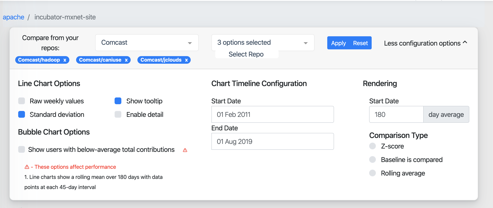
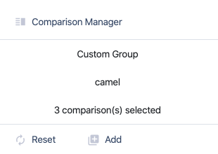

This week is the 10th week of Google Summer of Week and the last week of second phase. I add a control component for visulization based on new ui and refactor metric status worker. 

<!--more-->

## Work Done this Week

- Frontend
    - Add `CompareControl` component
        - a new version of MainControl based on new UI, keep all feature in old `MainControl`
        - Adappt to two different comparison types: Repo and Repo Group
        - 

    - Optimize Comparison Manager
      - Now can add repo/groub to compare by click add button in `Repos` and `Groups` table.
      - 
    - Update comparsion function 
    - Only Persist state path `common/cahce` in the local Storage now rather than persist all state
  
- Backend
  - Refactor Metric Status Worker
    - Extract backend implementation status by hit endpoint `batch/metadata` instead of pattern source code by regex.
  - Implement new Metric Status Endpoint
    - now endpoint data source is `augur_db` rather than extract website content

### Pull Requests
- [chaoss/Augur#338](https://github.com/chaoss/augur/pull/338): add CompareControl Component
- [chaoss/Augur#341](https://github.com/chaoss/augur/pull/341): Refactor Metric Status Worker

## Future Work 
- More Risk Metric Implementation 
- Add Forntend Route for comparsion and repo group
- Add new component for Repo Group 