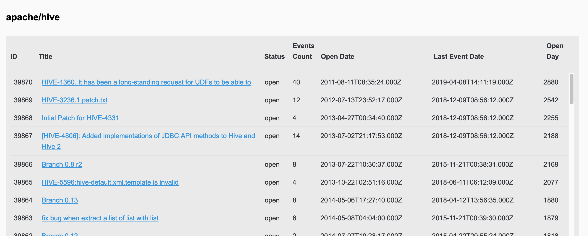
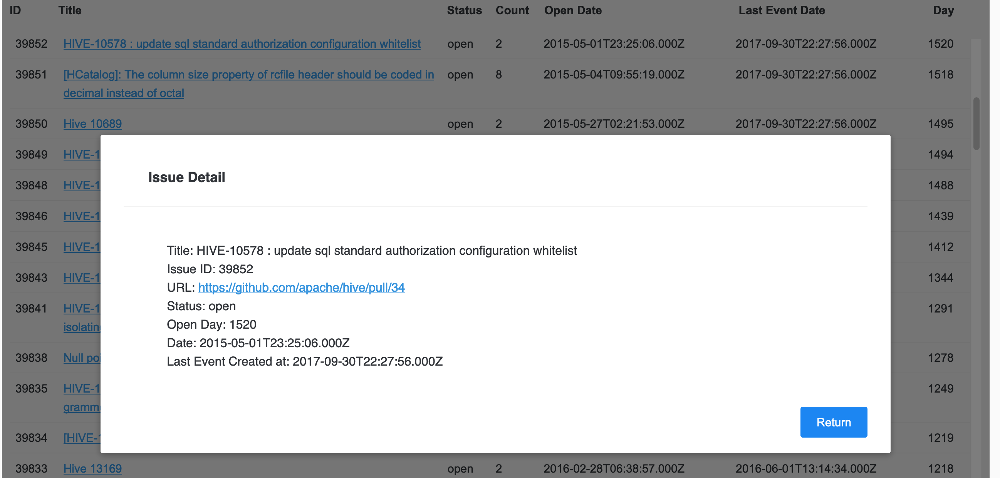
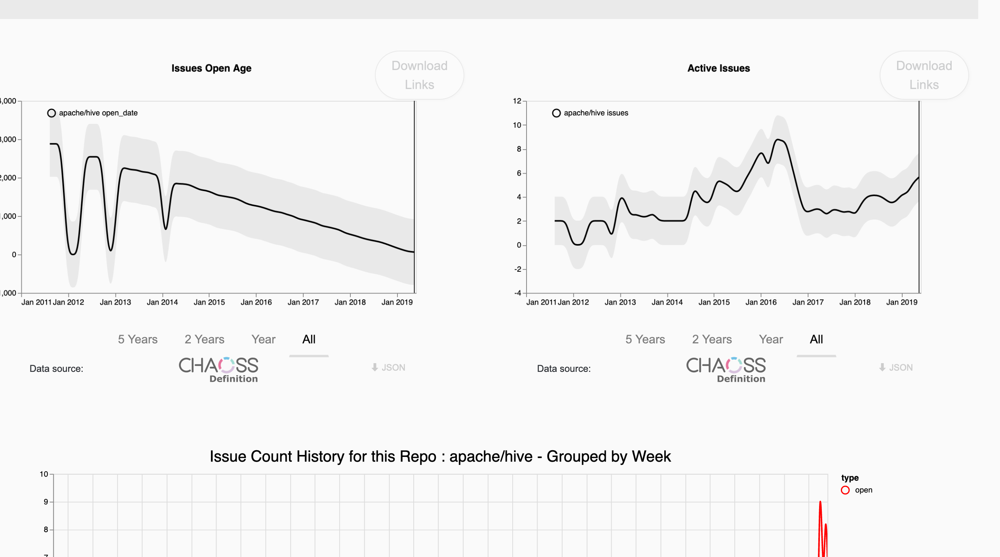

This week is the fifth week of Google Summer of Week. 

<!--more-->

## Meeting Log

Date: 06/25/2019, 06/28/2019 

- Develop froned page for issues data, show a list of issues for given repository
- a page for the specifics of a given issue 
- Summary visualization of metrics related to issues
  - parameterizable by a time window
  - visualization should be downloadable

## Work Done this Week

- Implemented a chart for issue data.

It is tricy to make the table scrollable. When we made `tbody` scrollable, the `thead` content would go into the same column. The solution is to put `tbody` and `thead` into two different `div` instead of `table` tag. 

- Added a Modal Component to display issue detail(pop up a float window)

The first idea about this part is to creat a seperate new page, but it would be a little confused because augur frontend organized by card and user experience would be not uniform
. This is why choose modal component to display issue detail which is much easy for user to understand. 

When I review coding work in this part, all work are simple and direct. I actually met challenge in passing parameter from parent component into child components and catching event from parenet component in developing. 

- visualization of a few metrics related to issue
    - issue active
    - issues open age

- fixed bug in helper function in `AugurAPI.js` for `augur_db` endpoints 
- Refactored metrics
    - `contributors`
    - `contributors-new`
- implemented `facade` metrics in `augur_db`
  - refactor `lines-changed-by-author`
  - implement `annual-commit-count-ranked-by-new-repo-in-repo-group` 

### Pull Request Created

- [chaoss/Augur#307](https://github.com/chaoss/augur/pull/307): add visulization metrics for Issue Card to brunch dev
- [chaoss/Augur#311](https://github.com/chaoss/augur/pull/311): stable-demo: add visulization metrics for Issue Card

## Plans for Next week 

- API Docs, Docs
- New Approach of fetching and showing Metrics Status 
- Refactoring the UI of basic repo stats pages