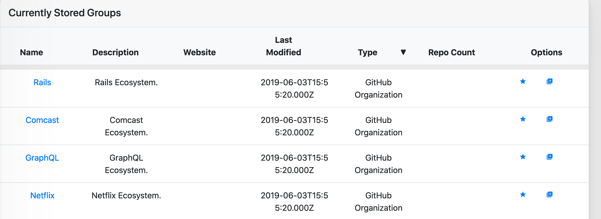

This week is the 9th week of Google Summer of Week and the last week of second phase. I worked on comparison functionality with the store and optimize some UI. 

<!--more-->

## Meeting Log

Date: 07/22/2019
- Summary the work recently

## Work Done this Week

- Frontend
    - Translate Vue Component to class style component in Typescript
        - RepoOvervie.vue
        - MainSidebar.vue
        - Spinner.vue
  - Fix Repos.vue and RepoGroups.vue table UI 
    - arrow in the same line with table header text
    
  - adds comparison functionality with the store
  - Persist Vuex State to local
    - import new package vuex-persistedstate
### Work Still in Progress
- adapt MainSiderbar.vue to new comparison store 
- Transfer Maincontrol.vue to new version

### Pull Requests
- [chaoss/Augur#332](https://github.com/chaoss/augur/pull/329): Persist Vuex State to local 
- [chaoss/Augur#335](https://github.com/chaoss/augur/pull/319):Add a new Vuex module 'compare' 

## Future Work 
- Finish Comparison work  
- Add more risk metric endpoints
- More future plans for next week to be decided in the next meeting on Monday, 29th July 2019.